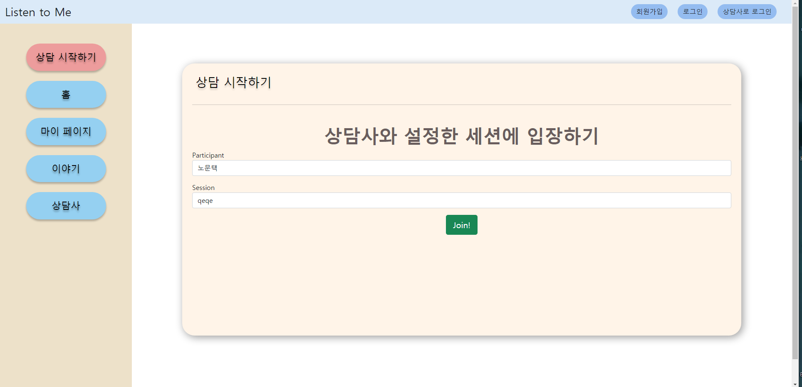
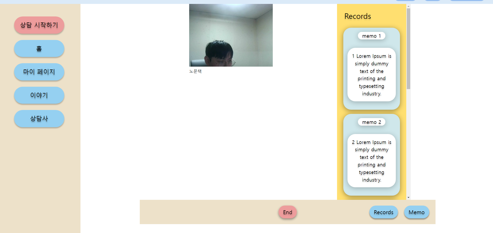
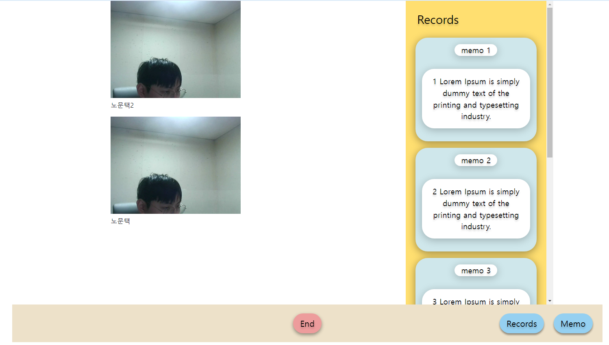

웹연동 진행

> * 담당자: 노문택
> * 작업 브랜치: `feature-webRTC-FE`
> * 최근 수정일: 2022-02-03

 

### 001. 상담 시작하기 누르는 화면 

 

 

> 추후 로그인후에 vuex를 통해 id 저장후 fix할예정 

 

### 002. 세션 시작 (상담자)

> 상담자가 세션시작

 

 

> 상담자가 세션시작 메모 및 다른기능누를때 깨지는 현상있는데 css 파일로 수정작업필요 

 

 

### 003. 도중난입 (내담자)

 

 

> 내담자 난입 케이스 frame 이 늘어낫다 줄엇다해서 고정 fix가 필요하고 고정 fix후에 한줄로 배치해야됨 

