**branch:** `feature-main_page`

## 😎 화면별 이슈 사항 정리

> 작성자: 박상현
>
> 최근 수정일시: 2022-02-10

 

### 001. 회원가입 및 로그인

 

#### 001.1. 비로그인 상태에서의 홈 화면

 

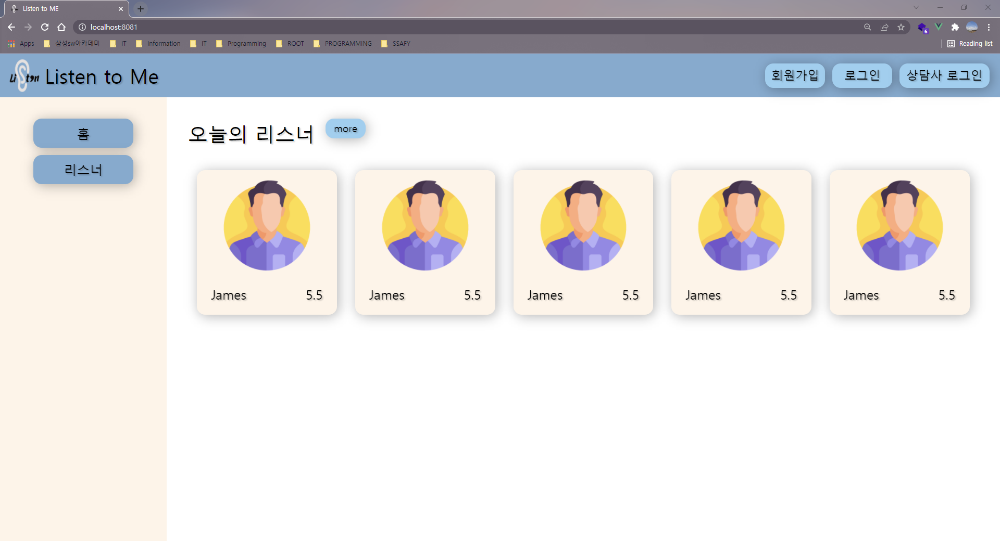

> 홈 화면 디자인 수정 예정 🔥
>
> * 서비스 소개 영역 추가
> * 네브바와 사이드바 통합 고려 중

 

#### 001.2. 회원 가입

 

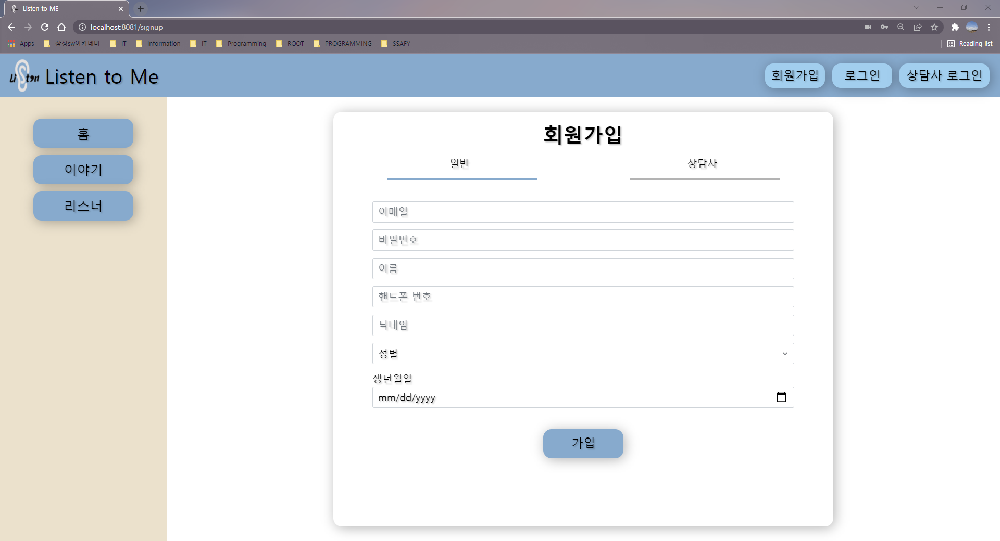

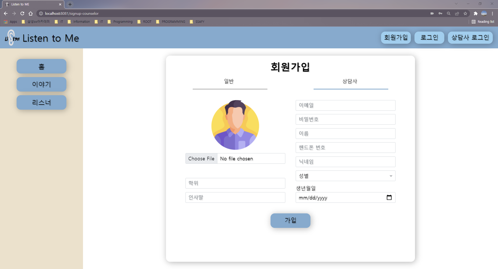

> 일반 유저와 상담사 유저를 분리하여 회원 가입 진행

 

#### 001.3. 로그인

 

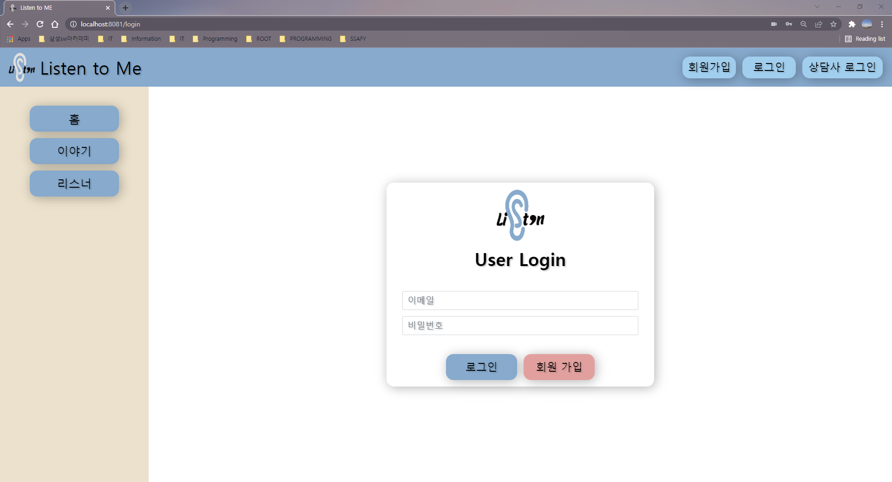

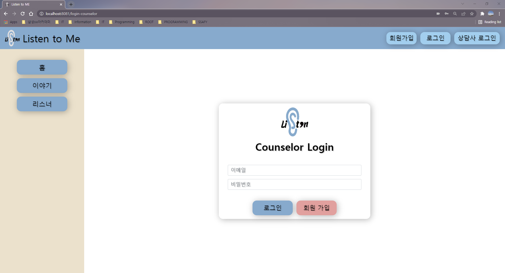

> 일반 유저와 상담사 유저를 분리하여 로그인 진행

 

#### 001.4. 일반 유저 로그인 후 마이 페이지 화면

 

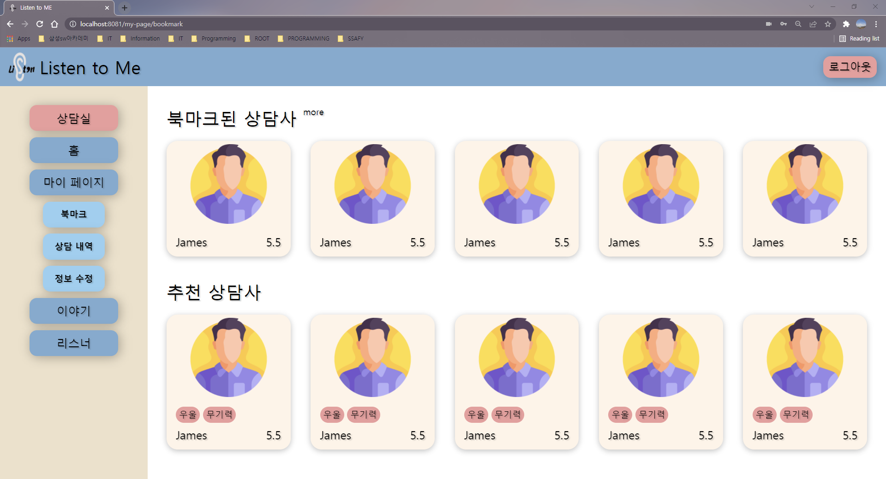

 

#### 001.5. 상담사 유저 로그인 후 마이 페이지 화면

 

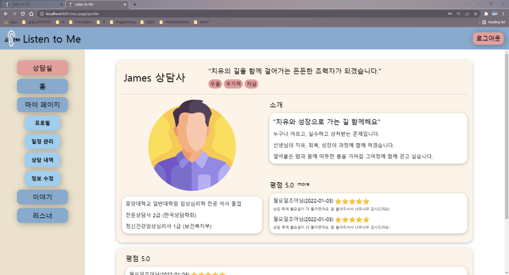

 

### 002. 상담실

 

#### 002.1. 상담실 입장 화면(상: 상담사, 하: 내담자)

 

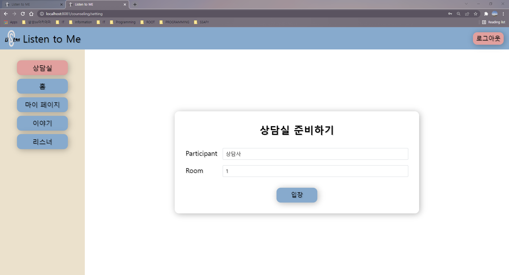

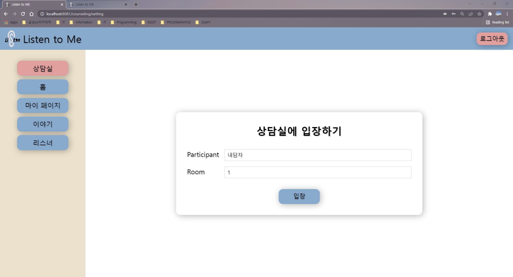

> 상담실 준비할 때(`입장 버튼` 클릭할 때) 해당 상담에 관한 정보를 넘겨줘야 함 🔥
>
> * 상담 예약과 관련된 페이지가 완성된 후 흐름을 살펴봐야 작성할 수 있을 듯

 

#### 002.2. 상담

 

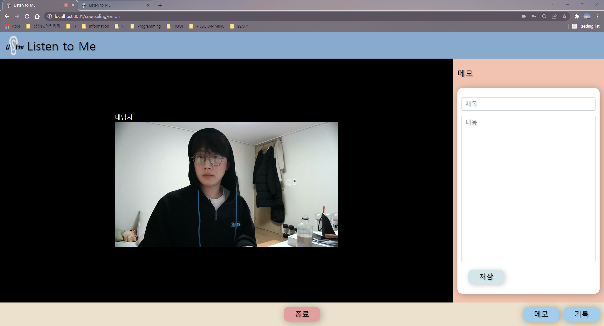

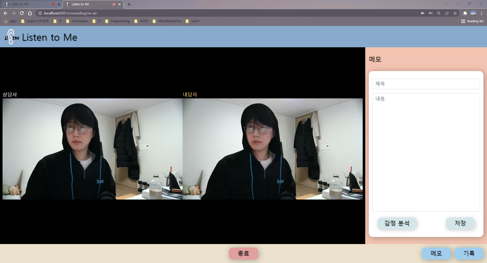

> 1. 상담 중에는 네브바의 서비스 로고와 이름을 클릭해도 홈 화면으로 라우팅되지 않도록 제어 완료
> 1. 상담 중에 의도치 않은 로그아웃 사태를 막기 위해 `로그아웃` 버튼이 표현되지 않도록 분기 처리 완료
> 1. 상담사 사이드에서만 `감정 분석` 버튼이 표현되도록 분기 처리 완료

 

#### 002.3. 상담 중 메모

 

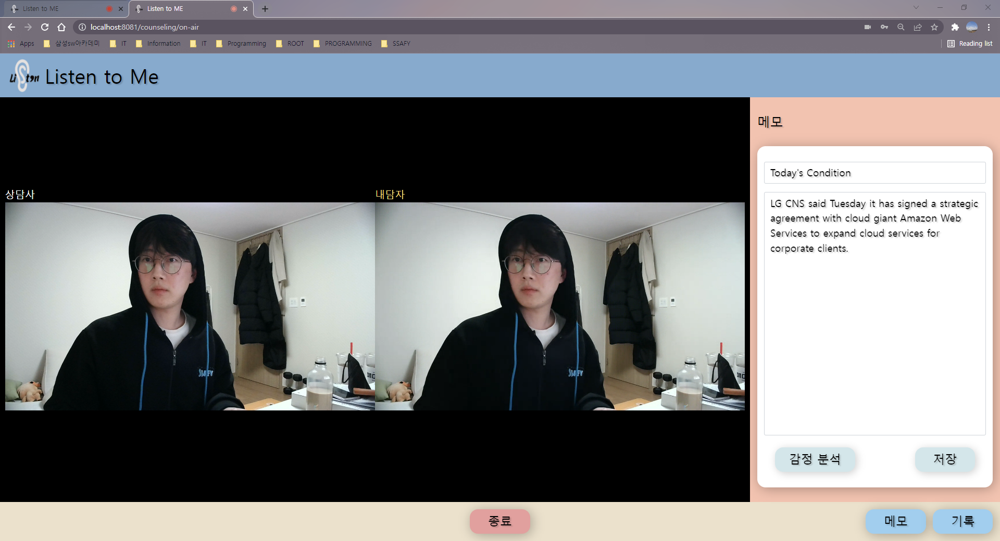

> 1. 빈 메모는 입력되지 않도록 처리함
>    1. 내용을 입력해달라는 메시지 출력
> 1. 저장이 완료되면 관련 메시지 출력

 

#### 002.4. 상담 중 감정 분석

 

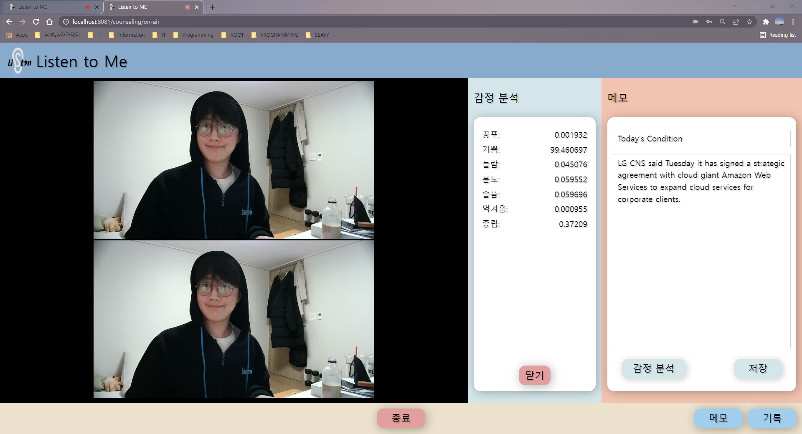

> 감정 분석의 응답에 딜레이가 있음... ⚡

 

#### 002.5. 상담 중 기록 확인

 

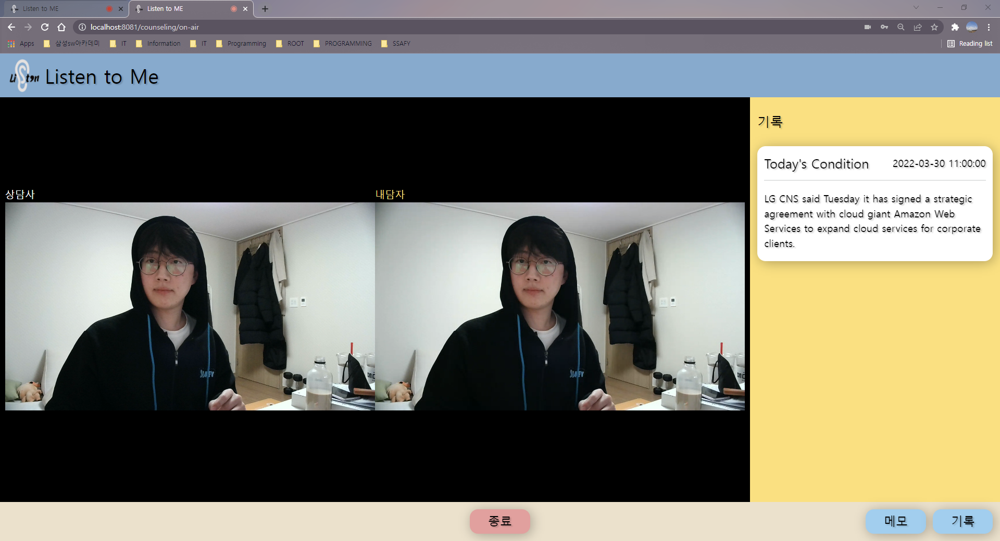

> 1. 기존 기록이 없을 때는 기록이 없다고 표현 처리 완료
> 1. 단... 메모 작성 중 기록 화면으로 넘어가면 메모에 작성 중인 내용이 사라짐 ⚡
>    1. 대신 기록 영역을 활성화할 때 메모를 자동으로 저장시켜주도록 해놨음
>    1. 한번 저장 하고 나서 새로 작성해서 저장하면 기존 메모를 덮어 쓰게 됨 ⚡

 

#### 002.6. 상담 중 스티커 화면

 

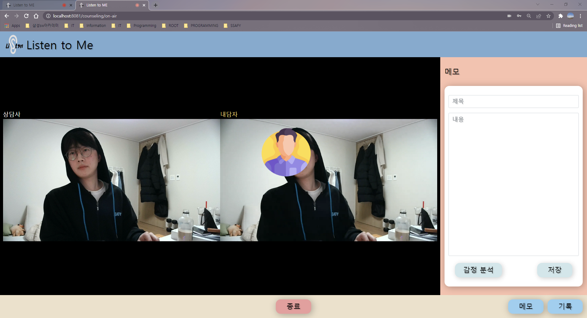

>성능이 너무너무 좋지 않음... 진지하게 버리는 걸 고민해보는 게 어떤가 함.. ⚡

 

#### 002.7. 상담 종료

 

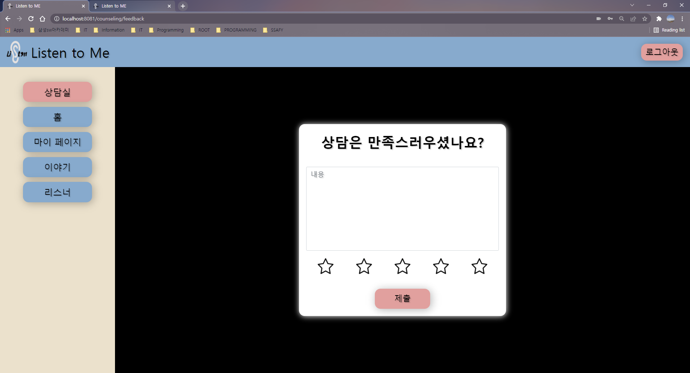

> axios 연결하면 상담실은 진짜 끝..?

 

### 003. 리스너

 

#### 003.1. 전체 리스너

 

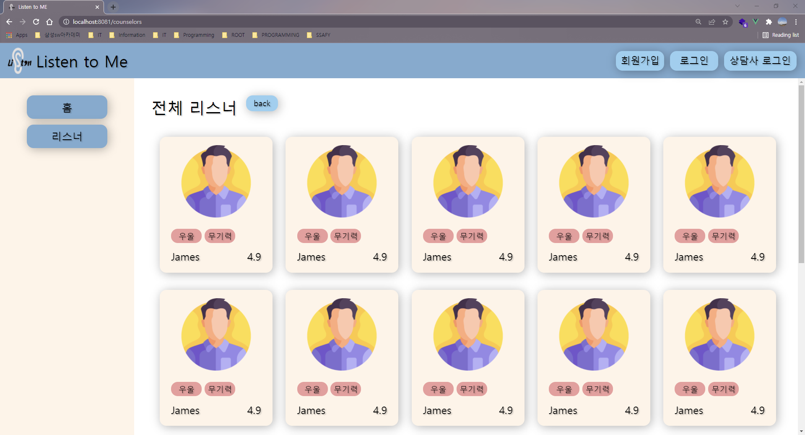
