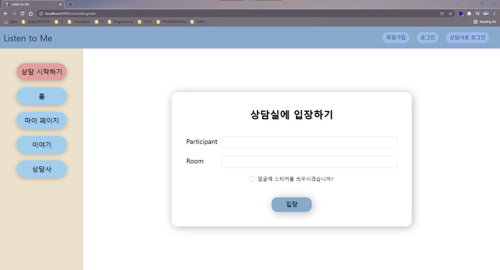
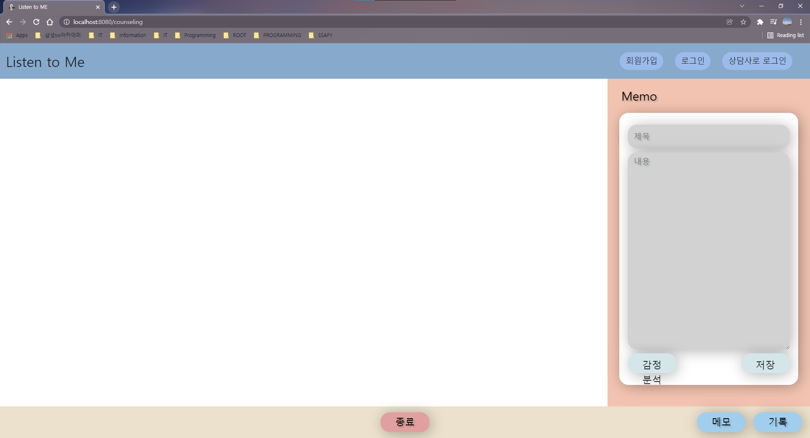
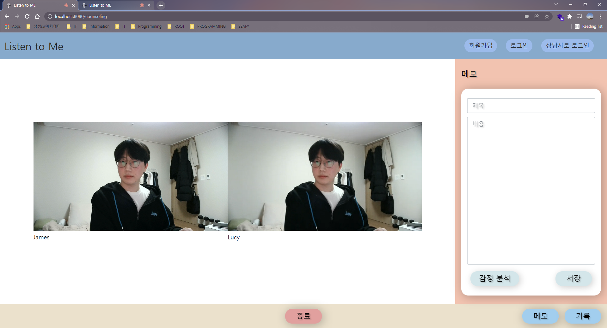
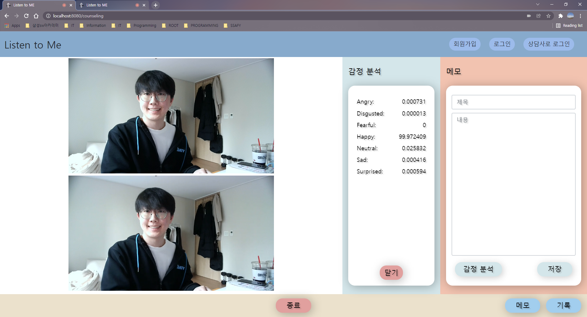
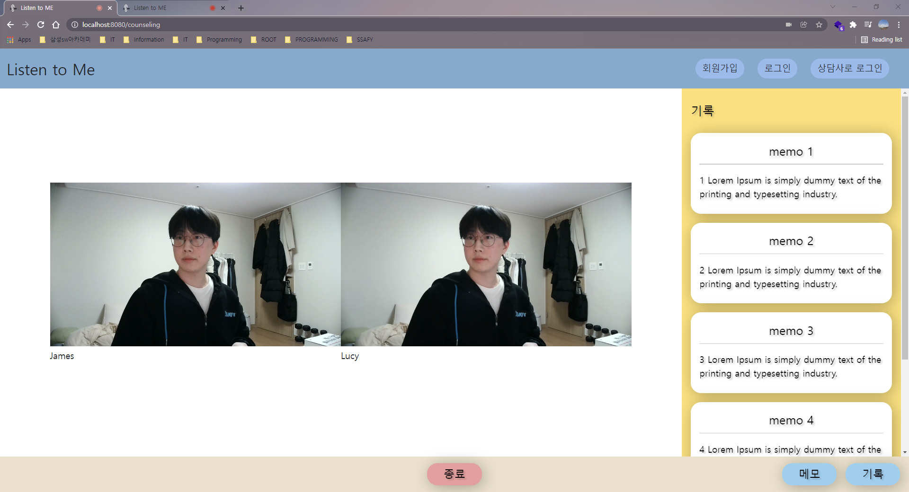

**BRANCH: feature-webRTC-FE**

## 🔥 webRTC 연동 및 얼굴 인식 기능 추가하기

> 담당자: 박상현
>
> 최근 수정일시: 2022. 02. 06. 22:15


<br>

#### 📌 개요

> 1. 기존 뼈대에 webRTC 기능을 연동하고 관련된 페이지 작성하기
>
>    1. 방(세션) 설정 페이지
>    1. 방 페이지
>    1. 방 피드백 페이지
>
>    <br>
>
> 1. 방 페이지에 얼굴 인식 기능 2가지 추가하기
>
>    1. 감정 분석 기능 추가하기: `감정 분석` 버튼을 클릭하면 분석 데이터 표현하기(토글링)
>
>    1. 스티커 기능 추가하기: 내담자 스트리밍 화면에서 얼굴 영역을 트래킹하며 스티커 씌워주기
>
>       * 1차: 방 설정 시에만 선택할 수 있고, 상담 진행 중에는 설정을 변경할 수 없음
>       * 2차: 상담 중에도 자유롭게 설정을 변경시킬 수 있도록 함
>
>       <br>
>
> 1. CSS convention 조정하기
>
>    * 페이지 및 기능별로 CSS의 컨벤션이 달라서 전반적으로 조정하고자 함


<br>

### 001. webRTC 연동


<br>

#### 001.1. 상담실 설정 화면

<br>



> 스티커 기능 사용 여부는 **"내담자"** 사이드에서만 displaying할 예정


<br>

#### 001.2. 상담실 footer

<br>



> footer 영역 높이 및 버튼 조정


<br>

#### 001.3. 상담실 메모




<br>

#### 001.4. 상담실 감정 분석




<br>

#### 001.5. 상담실 기록




<br>

### 003. CSS convention 정리


<br>

#### 003.1. `home.css`

<br>

```css
/* HOME */


/* 1. FONT */

/* 굵은 제목 */
.f-title-bold

/* 굵은 부제 */
.f-subtitle-bold

/* 부제 */
.f-subtitle

/* 본문 */
.f-normal

/* 버튼 */
.f-btn


/* 2. BUTTON */

/* 확인 */
.btn-ok

/* 취소 */
.btn-cancel

/* 도구 */
.btn-tool

/* 기능 */
.btn-func
```


<br>

#### 003.2. `counseling.css`

<br>

```css
/* COUNSELING */


/* 1. 상담실 입장: 상담실 세션 설정 */

/* 상담실 세션 설정 영역 */
.part-room-setting


/* 2. 상담: 상담 도구 및 기능 */

/* 비디오 영역 */
.part-video-hor

.part-video-ver 

/* 내담자 비디오 영역 */
#user-video:nth-of-type(2) > p

/* 메모 영역 */
#memo

/* 메모 폼 영역 */
.part-tool

/* 메모 폼 내용 */
.form-content

/* 감정분석 데이터 메시지 */
.area-msg

/* 기록 영역 */
#records

/* 상세 기록 영역 */
.part-record

/* footer */
.area-footer
```


<br>

End
