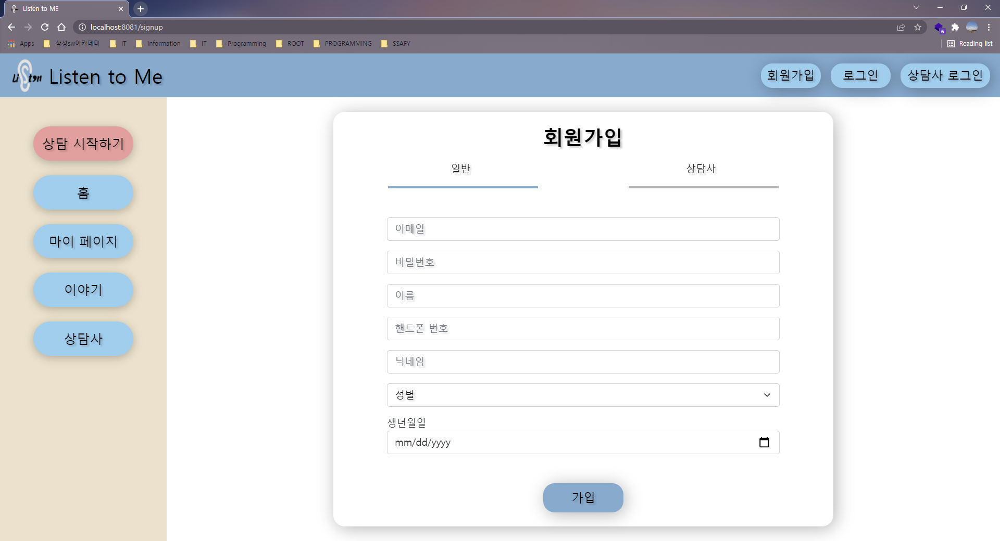
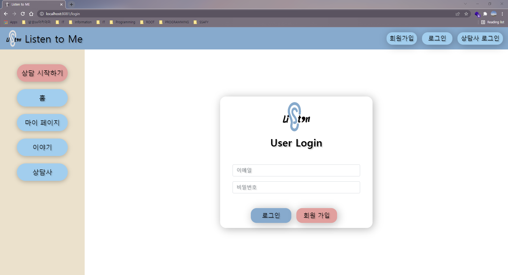
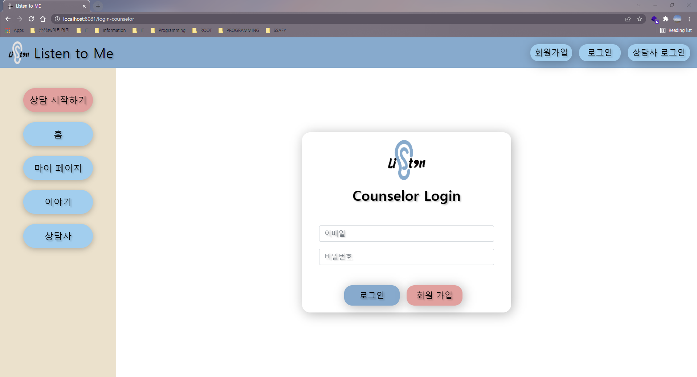

branch: `feature-webRTC-FE`

## 🍒 페이지 정리

> 작성자: 박상현
>
> 최근 수정일시: 2022. 02. 08. 19:28

 

### 001. 회원 가입

> 일반 유저와 상담사 유저를 분리하여 회원 가입 처리

 

 

 

### 002. 로그인

> 일반 유저와 상담사 유저를 분리하여 로그인 처리

 

 

 

