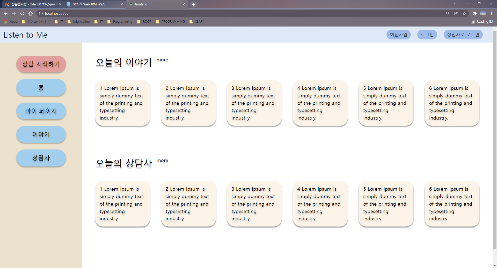
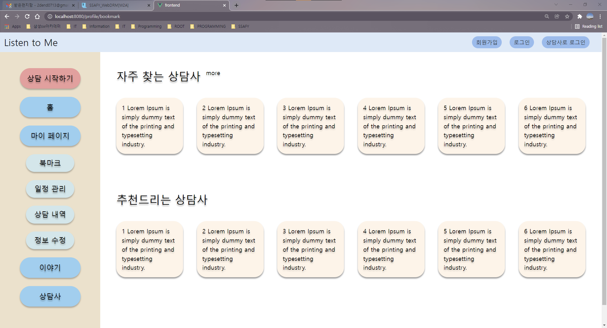
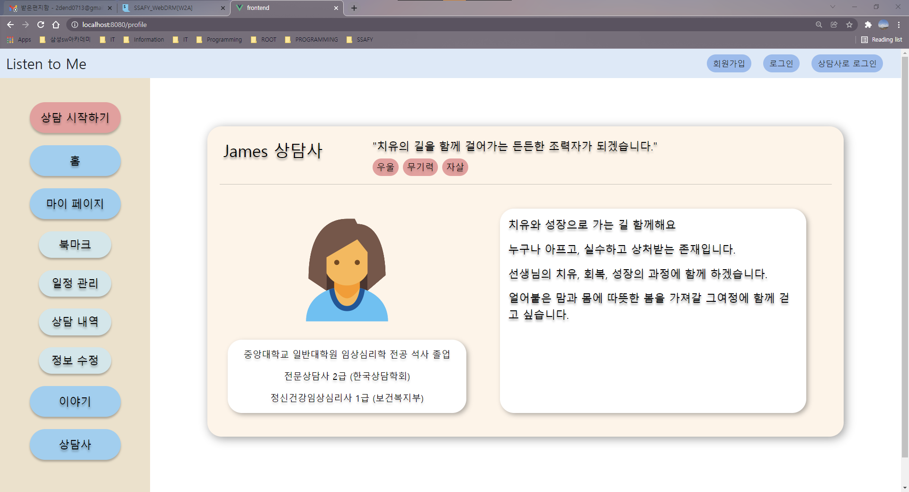

설 연휴 작업 내용 공유

> * 담당자: 박상현
> * 작업 브랜치: `feature-others`
> * 최근 수정일: 2022-02-02

 

### 001. 메인 화면

 

 

`components/SideBar.vue`

> 왼쪽 사이드바 부분. 일단 모든 메뉴를 드러내 놓았으며, 로그인 상태 및 유저 유형(상담사 or 내담자)에 따라 display를 토글시킬 예정.

 

`views/Home.vue`

> 메인 화면의 최상위 컴포넌트. 기존 와이어프레임에 따라 작성했으나, 게시판 기능이 추후 개발로 밀린 상황에 대한 업데이트가 필요함. 나중에 게시판을 구현한다면 현재 레이아웃(위 첨부사진 참고)을 그대로 사용하면 되나 만약 구현하지 않을 경우 메인 화면에 무엇을 띄울지에 대한 논의 필요.

 

### 002. 마이 페이지(내담자)

> 위에서 말했듯이, 현재 모든 메뉴를 노출시킨 상태. 나중에 상황별로 토글시킬 예정.

 

 

`views/profile/Bookmark.vue`

> 북마크 화면. 자주 찾는 상담사와 추천 상담사(by 협업 필터링)를 노출하는 화면. 메인 화면과 마찬가지로 일단 6개의 아이템을 뿌려주는 것으로 생각하고 레이아웃을 잡았음. 추천 상담사의 경우 화면에 뿌릴 개수를 직접 설정하면 되지만, 자주 찾는 상담사의 경우 화면에 뿌려지는 개수 이상으로 북마크 되어 있는 경우에 대한 처리 방식을 결정해야 함.
>
> 가령, 슬라이더를 활용해서 표현할 것인지, `more`을 클릭했을 때 전체 북마크된 상담사를 보여주는 페이지를 라우팅할 것인지.

 

 

`views/profile/Records.vue`

> 진행 예정 상담과 종료된 상담 목록 출력. 일단은 포인트 상세 내역 페이지를 따로 만들지는 않았고, 현재 잔여 포인트만 함께 보여주도록 짜놨음. 포인트 차감 내역만을 다루는 상세 페이지를 작성할 것인지에 대해 이야기를 나눌 필요가 있음.
>
> 개인적으로는 스케줄링 과정에서 포인트가 차감된다는 것만 보여주면 될 것 같고 포인트 차감 내역 자체를 보여줄 필요는 없을 것 같아서 포인트 내역 상세 페이지를 만들지 않아도 될 것 같다고 생각함.

 

### 003. 마이 페이지(상담사)

 

 

`views/profile/Profile.vue`

> 레이아웃을 대폭 바꿔서 상담사쪽 마이 페이지를 구현하였음...

 

👉 **마이 페이지 중 일정 관리, 정보 수정, 작성글 부분은 일단 제외 하였음**

> * **일정 관리**: 현재 버튼만 만들어 놓은 상태. 스케줄링 작업이 끝나면 이어서 활용하시면 될 것 같음.
> * **정보 수정**: 회원 가입/로그인 쪽 코드를 그대로 활용하면 될 것 같음. 이 부분을 담당하셨던 수민님께서 쉽게 작성하실 수 있을 거라 생각하여 일단 버튼만 만들어 놓았음.
> * **작성글**: 게시판 구현이 확정되면 그때 이어서 작업할 예정.

 
2. 로그인
   - 개인 / 상담가 분리
   - 개인 / 상담가 중 선택하여 로그인 하도록 구현
