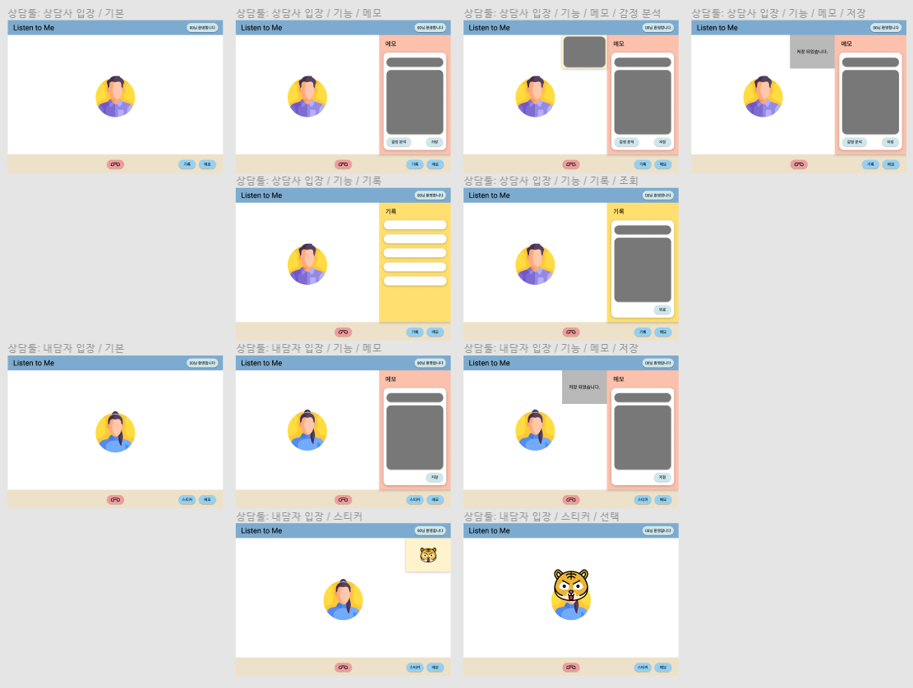

branch: feature-face_recognition

## 🔥 얼굴 인식을 기반으로 한 "스티커" 및 "감정 분석" 기능 개발

> 담당자: 박상현
>
> 최근 수정일시: 2022. 01. 16. 11:21

 

### 001. 기능 개요

> 언택트 시대를 맞이하여 **상담자와 내담자 간에 효과적의 의사소통(상담)**이 이루어지도록 도와주는 툴을 개발하는 것이 주된 목표입니다. 효과적인 상담을 위해 아래와 같은 **2가지 기능**을 제공합니다.

 

#### 001.1. 스티커 기능

(내담자 입장) 상담은 받고 싶지만 본인을 드러내는 것은 부담스러운 경우가 있습니다. 이를 해결하고자 상담자의 얼굴 영역을 트래킹 하며 스티커를 씌워주는 기능을 개발하고자 합니다.

 

#### 001.2. 감정 분석 기능

(상담사 입장) 실시간일지라도 송수신 되는 영상과 음성만으로는 화면 너머의 내담자를 정확히 파악하기 어렵습니다. 따라서 감정 분석 정보를 제공함으로써 상담사가 내담자의 현재 감정을 판단하는 데 도움을 주고자 합니다.

 

### 002. 와이어 프레임

> 서비스 흐름 ([자세히 보기👋](https://www.figma.com/file/g7tE8M7z7flv7QipCnSnwz/SSAFY-%EA%B3%B5%ED%86%B5-%ED%94%84%EB%A1%9C%EC%A0%9D%ED%8A%B8))

 

 

